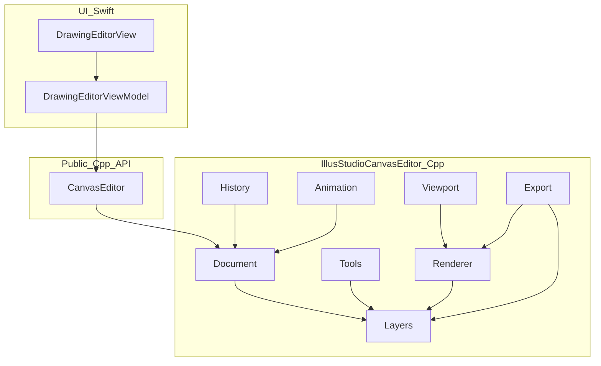

# IllusStudioFramework — IllusStudioCanvasEditor Architecture

C++ canvas engine for gmangastudio. Swift UI lives in page COPs (`DrawingEditor`); this framework owns document, layers, tools, viewport, and rendering. History, animation, and export are planned. See [AGENTS.md](../AGENTS.md) for the UI ↔ Engine contract.

**Version:** `0.7.0-cxx` (`CanvasEditor::version()`)  
**Tasks & roadmap (status):** [docs/ROADMAP.md](docs/ROADMAP.md)  
**Public API index:** [docs/API.md](docs/API.md)  
**Feature specs:** [canvas_document.md](docs/canvas_document.md) · [layer.md](docs/layer.md) · [brush_drawing.md](docs/brush_drawing.md) · [history.md](docs/history.md) · [animation_timeline.md](docs/animation_timeline.md) · [AI_Integration.md](docs/AI_Integration.md)

## Purpose

Build **IllusStudioCanvasEditor** (Procreate-style drawing editor) core:

- Page settings, layers, brushes/eraser, Procreate `.brush` / `.brushset` / `.brushlibrary` import
- Zoom/pan, Metal present (adaptive 72/120Hz + idle 5Hz in UI)
- Hybrid vector + raster: paint stamps into layer (procedural round); GPU composite
- Planned: tip silhouette + grain (T1-7-3b), undo/redo, timelapse, animation + timeline, image import, export PNG / SVG / TIFF

Swift UI uses the public C++ API via Swift–C++ interop (`SWIFT_OBJC_INTEROP_MODE = objcxx`). No C bridge.

```text
+-------------------------------------------------------+
|                 UI Layer (Swift / SwiftUI)            |  <-- Xcode Managed
+-------------------------------------------------------+
                           │ ▲
                           ▼ │  (Swift–C++ interop)
+-------------------------------------------------------+
|          Public C++ API (`illus::CanvasEditor`)       |
+-------------------------------------------------------+
                           │ ▲
                           ▼ │
+-------------------------------------------------------+
|     IllusStudioCanvasEditor / Core (C++)              |  <-- This framework
+-------------------------------------------------------+
```

## Target architecture



**Public facade:** `illus::CanvasEditor`  
**Internal facade:** `illus::IllusStudioCanvasEditor`

Session entry today: open/create document, pointer events (canvas space), tool / brush select, Procreate brush import, viewport, Metal present.  
Planned on the same facade: undo/redo, composite/export (PNG/SVG/TIFF), timeline ops.

Swift ViewModels call `CanvasEditor` only; they do not include internal `src/` headers.

## Module map

```text
IllusStudioFramework/
  IllusStudioFramework.h      Umbrella (C++)
  CanvasEditor.hpp            Public C++ API
  module.modulemap            requires cplusplus
  README.md                   Architecture (this file)
  docs/
    ROADMAP.md                Tasks & status (single checklist)
    API.md                    Public CanvasEditor API index
    canvas_document.md        Page setting, zoom/pan, export
    layer.md                  Layer management
    brush_drawing.md          Brush / eraser / hybrid drawing + image import
    history.md                Undo / redo / timelapse
    animation_timeline.md     Animation & timeline
    AI_Integration.md         AI-assisted features (reference → line-art, …)
  src/
    CanvasEditor.cpp          Public API pimpl
    IllusStudioCanvasEditor.hpp/.cpp   Internal facade
    document/                 PageSettings
    layers/                   Stack, opacity, blend (Normal), active layer
    tools/                    BrushLibrary, BrushSession, BrushAssetStore
      procreate/              .brush / .brushset / .brushlibrary import
    strokes/                  Stroke.hpp, StrokeSample.hpp (vector list)
    viewport/                 Zoom, pan, canvas↔view maps
    render/                   SoftwareRenderer, MetalRenderer,
                              StrokeRasterizer, MetalStrokeRasterizer,
                              LayerCompositor
    math/                     Blend, Rect, TileGrid, Bezier (Eigen),
                              PresentTransform (scalar NDC + GLM MVP helper)
    import/                   (planned) Raster import onto layers
    export/                   (planned) PNG / SVG / TIFF writers
    history/                  (planned) Undo/redo + timelapse
    animation/                (planned) Frames, timeline, onion-skin
  tools/
    tx7_math_bench.cpp        GLM / Eigen microbench
  third_party/
    metal-cpp/                Vendored Apple metal-cpp
    eigen/                    Eigen 5.0.1 (Bezier least-squares)
    glm/                      GLM 1.0.3 (presentModelMatrix / rotate later)
```

| Module | Owns | Does not own |
|--------|------|--------------|
| `CanvasEditor` | Swift-facing C++ surface | Internal headers |
| `document/` | `PageSettings`, document lifetime, background | UI chrome |
| `layers/` | Ordered stack, visibility/opacity/blend, active id, reorder/merge | Gestures |
| `tools/` | Brush presets, session, Procreate import, tip assets | Screen-space input |
| `strokes/` | Vector stroke list per layer | UI selection chrome (T2-6) |
| `import/` | *(planned)* Place decoded RGBA into a layer + transform | File pickers (UI) |
| `export/` | *(planned)* Encode composite to PNG, SVG, TIFF | Save panels / sharing UI |
| `viewport/` | Scale, offset, canvas↔view maps | SwiftUI MagnifyGesture |
| `history/` | *(planned)* Command stacks, timelapse event stream | Full video encode |
| `animation/` | *(planned)* Cels/frames, playhead, fps, timeline ops | Paint undo stack (separate) |
| `render/` | Composite → presentable buffer/texture; stroke raster CPU/GPU | Windowing |
| `math/` | Blend, rects, tiles, lazy Bézier (Eigen), present NDC (scalar) / MVP (GLM) | Public API types |

## Feature specs

Detailed specs live under `docs/` — expand those files, not this README.  
**Task ids / completion:** [docs/ROADMAP.md](docs/ROADMAP.md) only.

| Feature | Doc |
|---------|-----|
| Canvas page setting, zoom/pan, export | [docs/canvas_document.md](docs/canvas_document.md) |
| Layer management | [docs/layer.md](docs/layer.md) |
| Brush library, eraser, Procreate import, image import | [docs/brush_drawing.md](docs/brush_drawing.md) |
| History (undo / redo / timelapse) | [docs/history.md](docs/history.md) |
| Animation & timeline | [docs/animation_timeline.md](docs/animation_timeline.md) |
| AI integration | [docs/AI_Integration.md](docs/AI_Integration.md) |

## Performance notes

### Metal present

- Vendored under `third_party/metal-cpp`.
- `render/MetalRenderer`: shared `RGBA8Unorm` texture; dirty-rect `replaceRegion` upload from CPU composite (fallback).
- Hot present: GPU `LayerCompositor` + per-layer textures (T1-4); CPU `SoftwareRenderer` for self-check / export until T4.
- Public API: `presentMetalTextureAddress()` / `metalDeviceAddress()` / `metalAvailable()` / `setTargetPresentFps()`.
- UI: `CanvasMetalView` (`MTKView`) must use the **engine device**.
- Present rate: UI picks **120** when the panel supports it exactly, else **72**; engine caps composite rebuilds via `setTargetPresentFps`. Idle (≥30s) drops MTKView to **~5fps** ([canvas_document.md](docs/canvas_document.md) § App active status).

### Image processing & math

- Hot paths live in `math/`: float/premultiplied RGBA, blend, dab spacing, viewport (**scalar**).
- **Vendored math libs** (keep; gated use — [docs/ROADMAP.md](docs/ROADMAP.md) TX-7 best-use table + [cpp-math-libs skill](../.cursor/skills/cpp-math-libs/SKILL.md)):
  - `third_party/eigen/` (**5.0.1**) — `math/Bezier` least-squares; **lazy** on export (`ensureStrokeCubics`), never under `endStroke` mutex
  - `third_party/glm/` (**1.0.3**) — `presentModelMatrix` / canvas rotate later; **axis-aligned present stays scalar** (`presentNdcRect`)
- No GLM/Eigen types in public `CanvasEditor.hpp`.
- Microbench: `tools/tx7_math_bench.cpp`.
- Optional later: SIMD / Accelerate — only after CPU profiler evidence ([TX-4](docs/ROADMAP.md)).

### Display refresh

- Sustain presents up to **120Hz** while stroking when the display supports it; UI must not throttle below the adaptive pick (72 or 120) in performance mode.
- Dirty-rect + below-cache + GPU layer blend keep the budget feasible.

## Public API notes (Swift–C++ interop)

- Expose only `CanvasEditor.hpp` (+ umbrella). Keep `std::vector` / internal types out of the public header.
- Prefer `std::uintptr_t` over `void*` for Metal handles (Swift imports the former).
- App target: `SWIFT_OBJC_INTEROP_MODE = objcxx`.

## Self-check rule

Non-trivial modules leave **one** runnable check that fails if the core invariant breaks. Examples:

- Layers: composite of two opaque layers matches expected pixel
- Stroke: dab darkens active layer only
- History: undo restores prior active-layer hash *(when T3 lands)*
- Viewport: view→canvas→view round-trip within epsilon
- Export: tiny canvas → PNG bytes start with signature; TIFF/SVG non-empty and parseable *(when T4 lands)*
- Import: fixture `.brush` → set count +1

`CanvasEditor::selfCheck()` is the Swift-callable entry.

## Out of scope (framework-wide, for now)

- Full Procreate-style feature parity (liquify, complex blend catalogs, cloud)
- SwiftUI screens (those stay in `gmangastudio/DrawingEditor/`)
- New package-manager dependencies without an explicit ask
