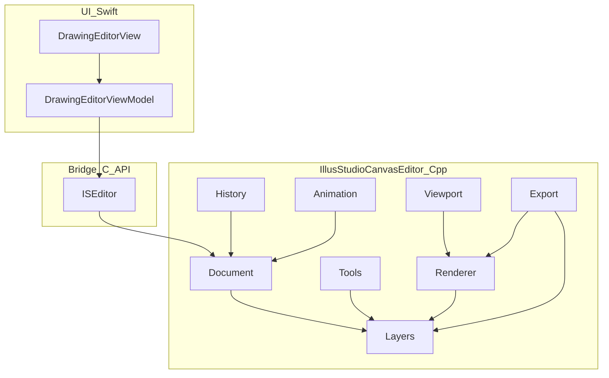

# IllusStudioFramework — IllusStudioCanvasEditor Architecture

C++ canvas engine for gmangastudio. Swift UI lives in page COPs (`DrawingEditor`); this framework owns document, layers, tools, viewport, history, animation, and rendering. See [AGENTS.md](../AGENTS.md) for the UI ↔ Bridge ↔ Engine contract.

## Purpose

Build **IllusStudioCanvasEditor** (Procreate-style drawing editor) core:

- Page settings, layers, brushes/eraser, image import
- Zoom/pan, undo/redo, timelapse recording
- Animation + timeline
- Export image formats: **PNG**, **SVG**, **TIFF**
- CPU path first; Metal (metal-cpp) for performance later

UI never includes engine headers. All Swift access goes through the C bridge.

```text
+-------------------------------------------------------+
|                 UI Layer (Swift / SwiftUI)            |  <-- Xcode Managed
+-------------------------------------------------------+
                           │ ▲
                           ▼ │  (Swift-C++ Interop / Unsafe FFI)
+-------------------------------------------------------+
|                 Bridge Layer (C API / Obj-C++)        |
+-------------------------------------------------------+
                           │ ▲
                           ▼ │
+-------------------------------------------------------+
|     IllusStudioCanvasEditor / Core (C++)                |  <-- This framework
+-------------------------------------------------------+
```

## Current state

| Piece | Status |
|-------|--------|
| `CanvasEngine` | Single RGBA8 buffer, soft brush stamp, CPU only |
| Public API | `ISCanvas*` in `ISCanvas.h` (create/clear/stroke/pixels/version/self-check) |
| Layers / history / viewport / Metal | Not implemented yet |

Migration path: grow internals under `IllusStudioCanvasEditor`; keep `ISCanvas` working; introduce `ISEditor*` as the full C surface; deprecate flat-buffer APIs when layers land.

## Target architecture



**Facade:** `illus::IllusStudioCanvasEditor`

Session entry for: open/create document, pointer events (canvas space), tool select, viewport, undo/redo, composite/export frame (PNG/SVG/TIFF), timeline ops.

Swift ViewModels call the C bridge only; they do not own stroke math or layer buffers.

## Module map (planned)

```text
IllusStudioFramework/
  IllusStudioFramework.h      Umbrella
  ISCanvas.h                  Legacy / thin canvas C API (keep during migration)
  ISEditor.h                  Full editor C API (target)
  module.modulemap
  README.md                   This plan
  src/
    IllusStudioCanvasEditor.hpp/.cpp   Facade
    document/                 Page size, background, metadata
    layers/                   Stack, opacity, blend, active layer
    tools/                    Brush library, stroke engine, eraser
    import/                   Raster import onto layers
    export/                   PNG / SVG / TIFF writers
    viewport/                 Zoom, pan, transforms, dirty rects
    history/                  Undo/redo commands + timelapse op log
    animation/                Frames, timeline, onion-skin data
    render/                   SoftwareRenderer + (later) MetalRenderer
    math/                     Vec/mat, curves, dab spacing, blend helpers
    bridge/                   ISCanvas.cpp → ISEditor.cpp
  third_party/
    metal-cpp/                Vendored Apple metal-cpp (P5)
```

| Module | Owns | Does not own |
|--------|------|--------------|
| `document/` | `PageSettings`, document lifetime, background | UI chrome |
| `layers/` | Ordered stack, visibility/opacity/blend, active id, reorder/merge | Gestures |
| `tools/` | Brush presets, stroke dabs, eraser mode | Screen-space input |
| `import/` | Place decoded RGBA into a layer + transform | File pickers (UI) |
| `export/` | Encode composite (and optional per-layer) to PNG, SVG, TIFF | Save panels / sharing UI |
| `viewport/` | Scale, offset, canvas↔view maps, dirty rects | SwiftUI MagnifyGesture |
| `history/` | Command stacks, timelapse event stream | Full video encode |
| `animation/` | Cels/frames, playhead, fps, timeline ops | Paint undo stack (separate) |
| `render/` | Composite → presentable buffer/texture | Windowing |
| `math/` | Hot-path math, premultiplied blend | Third-party deps by default |
| `bridge/` | Stable C ABI, handle lifetime, marshaling | Engine algorithms |

## Feature specs

Each feature lists **inputs**, **engine state**, **bridge ops**, **phase**, and **v1 out of scope**.

### 1. Canvas page setting

| | |
|--|--|
| **Inputs** | Width, height, background RGBA (optional DPI later) |
| **State** | `PageSettings { width, height, background }`; background as clear color or locked bottom layer |
| **Bridge** | `ISEditorCreate(w,h)`, `ISEditorSetBackground(...)`, getters for size |
| **Phase** | P0 |
| **v1 out** | Arbitrary canvas resize with content reflow; print templates catalog |

### 2. Layer management

| | |
|--|--|
| **Inputs** | Add/delete/duplicate/reorder; set opacity/visibility/blend; set active layer |
| **State** | Ordered `Layer` list (top = front); each layer has RGBA buffer (or tiles later), id, name, opacity, visible, blend |
| **Bridge** | `ISEditorLayerAdd/Remove/Duplicate/Move`, `SetOpacity/Visible/Blend/Active`, `GetCount/Info` |
| **Rules** | Strokes apply only to active layer; display = composite |
| **Phase** | P0 |
| **v1 out** | Layer groups, masks, full blend-mode catalog (start: Normal + Erase) |

### 3. Brush library & eraser

| | |
|--|--|
| **Inputs** | Tool mode (brush/eraser); preset id; size, hardness, opacity, spacing, color; pointer stream with pressure |
| **State** | `BrushPreset` library; active tool; in-progress stroke on active layer |
| **Bridge** | `ISEditorSelectTool`, `SetBrushParams`, `Begin/Continue/EndStroke` |
| **Eraser** | Dest-out / erase blend on active layer (not a separate buffer unless measured need) |
| **Phase** | P1 |
| **v1 out** | Shape stamps, dual brushes, smudge, wet mix |

### 4. Image import

| | |
|--|--|
| **Inputs** | Decoded RGBA bytes (or path decoded at bridge) + placement (fit/fill/offset/scale) |
| **State** | New layer or replace active; transform stored with layer |
| **Bridge** | `ISEditorImportRGBA(w,h,pixels, placement)` |
| **Phase** | P3 |
| **v1 out** | Vector/PDF import; camera capture pipeline |

### 5. Zoom & pan

| | |
|--|--|
| **Inputs** | Scale, pan delta, or absolute `Viewport { scale, offset }`; optional focus point |
| **State** | Viewport transform; dirty rects in canvas space |
| **Bridge** | `ISEditorSetViewport`, `ViewToCanvas` / `CanvasToView` helpers |
| **Rules** | UI may drive gestures; **engine owns** transform math; tools receive **canvas-space** points |
| **Phase** | P1 |
| **v1 out** | Rotate canvas, snap-to-pixel UI chrome |

### 6. History (undo, redo, timelapse)

| | |
|--|--|
| **Inputs** | Undo/redo requests; automatic push on committed ops |
| **State** | Command stack (`StrokeCommand`, `LayerCommand`, …); separate append-only **timelapse op log** with timestamps |
| **Bridge** | `ISEditorUndo/Redo`, `CanUndo/CanRedo`, timelapse export/replay hooks later |
| **Timelapse** | Record ops, not full framebuffer every stroke; replay composites when exporting |
| **Phase** | P2 |
| **v1 out** | Branching history; cloud sync of op logs |

### 7. Animation & timeline

| | |
|--|--|
| **Inputs** | Add/remove frame (cel), set fps, playhead, onion-skin range |
| **State** | Timeline: ordered frames; each frame references layer snapshot or cel stack; playhead index |
| **Bridge** | `ISEditorTimeline*` (frame CRUD, playhead, fps); paint still goes through tools on current frame’s layers |
| **Rules** | **Paint undo** vs **timeline undo** stay separate where possible (document in API comments) |
| **Phase** | P4 |
| **v1 out** | Audio scrub, complex tweening, GIF/MP4 export polish |

### 8. Export image formats (PNG, SVG, TIFF)

| | |
|--|--|
| **Inputs** | Format enum (`PNG` / `SVG` / `TIFF`); options: include background, flatten vs preserve structure, DPI/resolution scale, current frame (animation) |
| **State** | Read-only snapshot of composite (and layer list for structured SVG); no mutation of document |
| **Bridge** | `ISEditorExport(format, options, outBytes/outPath)`; returns buffer length + bytes or writes path via bridge helper |
| **PNG** | Flattened RGBA composite → lossless PNG (alpha preserved); primary raster export |
| **TIFF** | Flattened composite → TIFF (RGBA, optional DPI tags); prefer for print / high-bit workflows later |
| **SVG** | Vector-first where possible: background rect + per-layer groups; raster layer contents as embedded PNG (base64 or linked) when strokes are not retained as paths; true path SVG only if stroke vector data exists |
| **Rules** | UI owns file picker / share sheet; engine owns encode. Export uses **document pixels**, not viewport zoom |
| **Phase** | P3 (with import); PNG first, then TIFF, then SVG |
| **v1 out** | PSD/PDF, multi-page TIFF stacks, animated GIF/APNG, CMYK TIFF |

**Format matrix**

| Format | Kind | Source | Notes |
|--------|------|--------|-------|
| PNG | Raster | Flattened composite | Default share/export; alpha OK |
| TIFF | Raster | Flattened composite | DPI metadata; good for archival/print |
| SVG | Hybrid | Layers → groups; bitmaps embedded if needed | Best effort vector; not a full Illustrator path model in v1 |

## Performance

### metal-cpp (P5)

- Vendor Apple **metal-cpp** under `third_party/metal-cpp` (or use the Xcode-provided copy).
- `render/MetalRenderer`: composite visible layers → `MTLTexture` / IOSurface.
- Bridge exposes a presentable handle Swift can show in MetalKit / SwiftUI.
- Keep `render/SoftwareRenderer` for self-check, CI, and fallback.

### Image processing & math

- Hot paths live in `math/`: float/premultiplied RGBA, blend, dab spacing, viewport matrices, downsample for zoomed-out composite.
- **No new third-party math library** unless a measured bottleneck requires it.
- Optional later: SIMD intrinsics or Accelerate via a thin Obj-C++ shim — only after CPU profiler evidence.

## Phased roadmap

| Phase | Deliverable |
|-------|-------------|
| **P0** | `document/` + `layers/` + CPU composite; replace flat `CanvasEngine::pixels_` as the sole model |
| **P1** | Brush library + eraser + `viewport/` (zoom/pan); strokes in canvas space |
| **P2** | `history/` undo/redo + timelapse op log |
| **P3** | `import/` raster onto layer; `export/` **PNG** then **TIFF**, then **SVG** |
| **P4** | `animation/` model + timeline C API |
| **P5** | `MetalRenderer` (metal-cpp); CPU path remains for tests |

## Bridge migration

1. Keep `ISCanvas*` working for current `DrawingEditorViewModel`.
2. Add `ISEditor*` wrapping `IllusStudioCanvasEditor` (create, layers, tools, viewport, history).
3. Point Swift at `ISEditor`; implement `ISCanvas` as a thin adapter or remove once unused.
4. Prefer a small C API; Obj-C++ only when wrapping Metal/IOSurface/CG types.

## Self-check rule

Non-trivial modules leave **one** runnable check (assert demo or tiny test) that fails if the core invariant breaks — same ponytail rule as the app. Examples:

- Layers: composite of two opaque layers matches expected pixel
- Stroke: dab darkens active layer only
- History: undo restores prior active-layer hash
- Viewport: view→canvas→view round-trip within epsilon
- Export: tiny canvas → PNG bytes start with signature; TIFF/SVG non-empty and parseable

`ISCanvasSelfCheck` / future `ISEditorSelfCheck` stay the Swift-callable entry.

## Out of scope (framework-wide, for now)

- Full Procreate-style feature parity (liquify, complex blend catalogs, cloud)
- SwiftUI screens (those stay in `gmangastudio/DrawingEditor/`)
- New package-manager dependencies without an explicit ask
